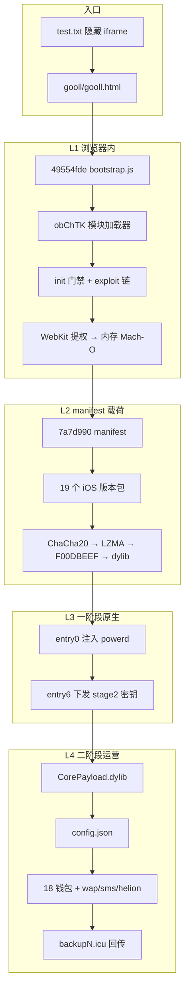

It costs 3,000 USDT dollars to obtain the more complete version and access to the C2 panel. Telegram contact: @buheige

# gooll / Coruna 整套运行逻辑（中文理解）

> 本文档基于 `_analysis/` 目录下的静态拆解、抓包样本与报告整理，用于**安全研究**场景下理解攻击链全貌。渠道样本：`1DECX7UIQIB09`。

---

## 一、一句话总览

这是一套针对 **iOS Safari / WebKit** 的多阶段攻击框架：先用**隐藏网页**加载混淆 JavaScript 完成浏览器内提权与原生代码执行，再通过 **manifest 版本包** 把 Mach-O 注入系统进程（如 `powerd`），最后由 **二阶段 CorePayload** 连接长期 C2（`backup{N}.icu`），按手机上已安装 App 的 `bundleId` **下载、解压、注入** 对应钱包/监控插件，窃取助记词、密钥库、聊天记录等数据并回传。

运营上至少存在**两套域名体系**：

| 阶段 | 典型域名 | 作用 |
|------|----------|------|
| 投递 / 登记 | `ipsadminuser.shop` | 渠道登记、下发 bootstrap 与 exploit JS |
| 感染后控制 | `backup1.icu` … `backup5.icu` 等 | JSON 配置、模块下载、数据外泄 API |

---

## 二、端到端流程（受害者视角）



**时间顺序简述：**

1. 用户打开带 `test.txt` 的页面 → 零尺寸 iframe 加载 `gooll.html`。
2. Safari 执行 bootstrap → 登记 IP/渠道 → 拉取大量 `.js` 模块。
3. exploit 成功后在内存中解析 Mach-O，加载 Coruna 一阶段。
4. 一阶段驻留、解密拉取 stage2，连接 `backup*.icu`。
5. CorePayload 定时刷新配置，发现目标 App 则下载对应 `*lib.dylib` 并注入进程。
6. 各插件 Hook 钱包 API / 读 SQLite·Realm·Keychain，POST 到 C2。

---

## 三、入口与渠道登记（L1 前半）

### 3.1 网页入口

根目录 `test.txt` 仅含一行隐藏 iframe，指向 `/gooll/gooll.html`，用户几乎无感知即开始加载整套 JS。

### 3.2 Bootstrap 外层（`49554fde7424c31c.js`）

拆解副本：`_analysis/decoded/bootstrap_outer.js`。

主要职责：

- 通过 `atob(...)` 安装全局 **`obChTK`** 模块加载器。
- 调用 **`fqMaGkNR`** 一类启动流程：初始化渠道、设备信息、定时刷新。
- 向 C2 登记受害者信息。

**已还原的关键 IOC：**

| 项 | 值 |
|----|-----|
| 渠道码 | `1DECX7UIQIB09` |
| 取 IP | `GET https://ipv4.icanhazip.com` |
| 上报 | `POST https://ipsadminuser.shop/api/ip-sync/sync` |
| 字段 | `channelCode`, `ip`, `deviceVersion`, `domain` |

登记完成后，bootstrap 通过 **`ZKvD0e`** 从 CDN 根路径（如 `/.a7d79990...`）按模块 ID 的 SHA1 哈希拉取远程 `.js` 文件；本地 `gooll/` 目录约 51 个 hash 命名文件是这些模块的**离线镜像**（与 CDN ID 前缀相近但不完全一致，以 `decoded/module_map.json` 为准）。

---

## 四、浏览器内模块体系（obChTK）

### 4.1 加载器 API（核心机制）

`obChTK` 是整套 JS 的「操作系统」，主要 API：

| API | 作用 |
|-----|------|
| `hPL3On(id)` | 同步执行已缓存/内嵌模块 |
| `fgPoij(xorArr, b64)` | XOR 解码模块名 + Base64 解码源码，注册新模块 |
| `ZKvD0e(xorArr)` | XOR 得模块 ID → SHA1(前缀+id) → HTTP GET `hash.js` |
| `po3QmN(url)` | 设置 CDN 根 URL |
| `eW4__H(prefix)` | 设置模块 ID 哈希前缀 |

**远程拉模块公式：**

```
moduleId = XOR 数组还原的明文
fileHash = SHA1(prefix + moduleId).slice(0, 40)
GET cdnRoot + fileHash + ".js"
```

### 4.2 内嵌 MM 表（无需网络的两块基石）

Loader 内 `MM` 仅 2 个 SHA1 键，Base64 内嵌完整 JS：

| 模块 | 作用 |
|------|------|
| `57620206…` | 内存原语：`addrof` / `fakeobj`、BigInt 地址操作 |
| `14669ca3…` | **init 门禁**：平台/版本检测、`F.yn` 缓冲句柄、`lr()`/`cr()` 运行时路径选择 |

### 4.3 init 门禁（能否继续 exploit）

`init_module.js`（`14669ca3…`）在 exploit 前做环境判断，例如：

- iOS 版本门槛（如 `xn >= 130000` 一类内部版本号）。
- `lr()`：在 JSC 堆上扫描，定位二次解密后的 **Mach-O 内存对象**，赋给 **`F.yn`**（不是 atob 的直接结果，而是 exploit 成功后内存里的 ArrayBuffer 句柄）。
- `cr()` / `ur()`：按 iOS 17/18 等分支选择后续原生加载路径。

**设计意图：** 不满足条件的设备直接退出，减少暴露与崩溃。

### 4.4 本地 JS 的三类形态

| 类型 | 数量级 | 静态处理 |
|------|--------|----------|
| **fgPoij 包装** | 6+ 层嵌套 | XOR 模块名 + Base64 → `decrypted/modules/fgPoij/` |
| **plain 明文模块** | ~41 | 复制 + XOR 字符串去混淆 → `deobfuscated/` |
| **qbrdr 载荷** | 30 | 仅 `atob` → 高熵 `.bin`（**无法静态再解密**） |

---

## 五、WebKit Exploit 链（浏览器内提权）

### 5.1 模块分工（si → ga → Mach-O → qbrdr → SAB）

| 阶段 | 典型模块 | 职责 |
|------|----------|------|
| **si** | `ff4f3cb4…`, `6beef463…` | WebKit 指纹、JIT 原语、主 exploit |
| **ga** | `3fd66b32…`, `4a75f055…` | Hook / 环境数据收集 |
| **Mach-O 解析** | `ba712ef6…`, `aea58f0e…` | `Y(F.yn)` 解析 Mach-O header、load commands |
| **qbrdr** | 30× `.bin` 源 | Base64 传入共享内存，二次解密在运行时完成 |
| **SAB Worker** | `22d56c45…`, `710628d3…` | SharedArrayBuffer + Native 桥 |
| **loader** | `9af53c1…` | 注册 `window.qbrdr`，驱动 Worker 状态机 |

### 5.2 qbrdr 数据流（静态边界）

```
qbrdr("Base64...") 
  → atob → 写入 SharedArrayBuffer[8..]     ✅ 静态可到 .bin
  → exploit 内自定义解密 → 高熵密文         ❌ 熵 ~7.99，无标准压缩魔数
  → r.lr() 在堆上找到 F.yn 句柄            ❌ 需动态 hook
  → Y(F.yn) 当 Mach-O 解析                 ❌ 依赖上一步
  → 原生执行 / 加载 Coruna 一阶段           ❌ 需真机 WebKit
```

**结论：** 静态分析可还原 **~77/80** 个本地 JS 到可读层；**30 个 qbrdr .bin + 13 个仅 CDN 存在的远程模块** 无法在离线环境完成载荷解密。

### 5.3 调用链简图

```
HTML → bootstrap → init(门禁) → ZKvD0e 拉 exploit 模块
  → si(WebKit) → ga(Hook) → fgPoij(Mach-O 解析器)
  → qbrdr(atob) → loader.LA() → SAB Worker → 原生桥
  → init.lr() 定位 F.yn → Y() 解析 → 加载 Coruna entry0
```

---

## 六、Coruna 载荷包（manifest → Mach-O）

 exploit 成功后，bootstrap 侧还会处理 **manifest 清单**（hash `7a7d99099b035b2c6512b6ebeeea6df1ede70fbb`），内含 **19 条** 按 iOS 版本区分的 payload 条目。

### 6.1 解密链（与 GitHub coruna 研究版一致）

```
qbrdr Base64 密文
  → ChaCha20（DJB 变体，nonce/counter = 0）
  → 魔数 0x0BEDF00D + LZMA/XZ
  → F00DBEEF 容器
  → entry*_type0x*.dylib / .bin
```

- **主密钥**：bootstrap 内 `fqMaGkN4([3436285875,…])` 还原的 32 字节。
- **每文件子密钥**：manifest 内 per-entry 32B。
- **输出目录**：`_analysis/decrypted/coruna-payloads/<hash>/`
- **脚本**：`node _analysis/scripts/decrypt-coruna-payloads.cjs`

### 6.2 entry0 与 entry6 分工

| 组件 | 体积级 | 作用 |
|------|--------|------|
| **entry0**（如 `377bed74` iOS17 arm64e） | ~229KB | 注入 `powerd`、CFHTTP 底层通信、拉起 stage2 |
| **entry6 配置块** | 小配置 | magic `0x12345678`，列出 stage2 两个 hash 及各自 ChaCha 密钥 |

entry6 示例（377bed74 专用）：

| # | stage2 hash | 用途 |
|---|-------------|------|
| 1 | `4612aa650e60e2974a9ec37bbf922c79635b493a` | stage2 变体 A |
| 2 | `4817ea8063eb4480e915f1a4479c62ec774f52ce` | stage2 变体 B |

---

## 七、二阶段 Stage2 / CorePayload（L4 大脑）

### 7.1 从 show.html 到 config.json

Stage2 dylib（~700KB）与完整 **CorePayload**（`new.js` → 解压后 ~2.3MB `CorePayload.dylib`）共用一套 **PLNet** 协议：

1. 访问 `https://backup%u.icu/details/show.html`（或同类 URL）。
2. HTTP 响应为 **7zAES** 压缩包（密码：`abf3bdc8e239c0f3183c257f9ccc23e8`，由 `scan-stage2-7z-password.cjs` 从 dylib 字符串扫出）。
3. 解压得到 **`config.json`**：列出各目标 App 的 `bundleId`、模块 URL、`sha256`、`size` 等。
4. 配置可缓存、校验服务器、按域名限流 ping。

**注意：** URL 常以 `*.js` 命名，但**响应体不是 JavaScript**，而是与 show.html **同密码的 7z**，内层才是 Mach-O。

### 7.2 CorePayload 调度流程

CorePayload 是 L4 **调度核心**（非独立 JS eval）：

```mermaid
flowchart LR
  A[启动 startWithConfig] --> B[downloadConfigurationFromURL]
  B --> C[decryptConfigurationData / parseConfigurationData]
  C --> D[buildBundleIdIndex 建索引]
  D --> E[监控 App 安装变化]
  E --> F[downloadModuleFromEntry]
  F --> G[7z 解压 plzma]
  G --> H[PLModuleStore 落盘]
  H --> I[PLProcessInjectionManager 注入]
  I --> J[目标进程 _plugin_main]
```



**核心类（字符串还原）：** `PLNetConfig`、`PLDownloadManager`、`PLModuleStore`、`PLProcessInjectionManager`、`PLUnifiedInjectionCoordinator`。

**本地维护开关（/tmp）：** `uninstall`、`relaunch`、`upgrade.dylib`、`stop`、`pl.sp.exec.guard.lock` 等。

### 7.3 模块下载与校验

对每个 `config.json` entry：

1. `downloadDataFromURL` 拉取 `https://backupN.icu/details/a1lib.js` 等。
2. `verifyDataIntegrity:expectedSHA256:expectedSize:` — **校验对象是 7z 内层 dylib**，不是外层 7z 文件。
3. `atomicReplaceModuleData:withSHA256Hash:forBundleId:` 原子替换缓存。
4. 失败退避：`shouldThrottleDownloadForBundleId:` / `calculateBackoffIntervalForBundleId:`。

### 7.4 注入目标进程

- 入口符号统一：**`_plugin_main`**。
- 通过 `injectDylibToPid` / `_injectDylibToName` 注入钱包或系统进程。
- 可选 **冷启动注入**：先 `terminateBackgroundTargetAppsForColdStartInjection`，对应 config 中 `requiresColdStart` 标志。
- SpringBoard 有单独路径：`injectSpringBoardWithError`。

---

## 八、L4 运营模块矩阵（窃取面）

`config.json` 典型含 **22 条 entry**（18 钱包 + SpringBoard + WhatsApp + SMS）+ **core** `new.js` → CorePayload。

### 8.1 钱包插件（按 bundleId 投递）

| lib | 目标 App | bundleId | 主要窃取手段 |
|-----|----------|----------|--------------|
| a1lib | MetaMask | `io.metamask.MetaMask` | HookManager 钩 `mnemonic` / vault |
| b2lib | imToken | `im.token.app` | `encMnemonic`, AsyncStorage |
| c3lib | TronLink | `com.tronlink.hdwallet` | sqlite + 助记词 |
| d4lib | Trust | `com.sixdays.trust` | **Realm** + keychain（体积最大 ~6.7MB） |
| e5lib | Coinbase | `org.toshi.distribution` | sqlite `main.wallet`, saveMnemonic* |
| f6lib | BitKeep | `com.bitkeep.os` | keychain + sqlite |
| g7lib–s19lib | Tonkeeper 等 | （见 batch 表） | 多数含 wallet-secrets + plnet |
| t20lib | OKX | `com.okex.OKExAppstoreFull` | sqlite `coin_asset`, OKWeb3Security |
| j10lib | MyTonWallet | `org.mytonwallet.app` | JS 注入 + OpenSSL |

完整能力表：`_analysis/reports/c2-modules-batch-summary.md`  
18 份钱包深报索引：`_analysis/reports/c2-modules-wallet-deep-index.md`

### 8.2 监控 / 通信模块

| 模块 | bundleId | 能力概要 |
|------|----------|----------|
| **wap** | `net.whatsapp.WhatsApp` | Axolotl/ChatStorage.sqlite、Keychain 静态密钥、`POST /api/wp/t` 等 |
| **sms** | `imagent` | SMS / iMessage |
| **helion** | `com.apple.springboard` | SpringBoard 层监控 |

WhatsApp 典型 API 路径：`/api/session/connect`、`/api/msg/upload`、`/api/chat/waitSend/list` 等（与 stage2 共用 `backup%u.icu`）。

### 8.3 数据回传共性

各 dylib 内嵌 **PLNetConfig** 与 C2 通信栈（NSURLSession），通过 Hook Objective-C / Swift 方法、读本地数据库、导出 Keychain 等方式收集敏感数据，再 POST 到 `backupN.icu` 上对应 API 路径。字符串中可见 `uploadmnem:`、`uploadMeta:`、`HookManager` 等外传接口名。

---

## 九、`_analysis` 分析流水线（本仓库如何「理解」它）

本目录**不参与**原始 payload 执行，只做离线拆解与报告生成。

### 9.1 目录角色

| 目录 | 内容 |
|------|------|
| `decoded/` | bootstrap、init、loader、module_map、XOR 字符串表 |
| `decrypted/` | 全量解密 JS、qbrdr .bin、coruna dylib、去混淆副本 |
| `fetched/` | 远程 13 模块、GitHub coruna 对照、config-probe 抓包 |
| `reports/` | 拓扑、钱包矩阵、深报、IOC |
| `scripts/` | 可重复运行的 Node 分析脚本 |
| `hooks/frida/` | 授权实验机上的动态验证脚本 |

### 9.2 一键重跑

```bash
node _analysis/scripts/run-all.cjs
```

顺序大致为：`deep1`–`deep8`（解码与映射）→ `decrypt-all` → qbrdr/obChTK 专项 → 若存在 `fetched/captures/config-probe/modules/backup1.icu/` 则跑 C2 batch、拓扑、18 钱包深报等。

跳过深报以加速：`SKIP_C2_DEEP=1 node _analysis/scripts/run-all.cjs`

### 9.3 动态抓包（可选，隔离环境）

| 脚本 | 产出 |
|------|------|
| `playwright-bootstrap-capture.cjs` | ip-sync 流量 |
| `playwright-ios-sim-capture.cjs` | ZKvD0e 模块 GET |
| `lab-probe-config-urls.cjs` | backup*.icu 全 URL 探测 → `config-probe/` |
| `export-probed-modules.cjs` | 解压后的 `*.dylib` 样本 |
| mitmproxy `lab_backup_capture.py` | 真实 Safari 代理抓包 |

详见：`_analysis/fetched/captures/README.md`、`_analysis/mitmproxy/README.md`。

### 9.4 静态 vs 动态能力边界

| 能做 | 不能做（需真机 + exploit 成功） |
|------|--------------------------------|
| 还原 bootstrap / obChTK / fgPoij / plain JS | qbrdr L7 自定义密文 → 明文 Mach-O |
| 解密 Coruna manifest 全链到 dylib | 13 个仅 CDN 存在的远程模块（可脚本轮询拉取） |
| 分析 stage2 / 钱包 dylib 字符串与符号 | 100% 还原运行时注入时机与加密会话密钥 |
| 7z 解压 config-probe 样本 | 在带真实钱包设备上验证 Hook 效果（仅授权实验） |

---

## 十、四层对照总表

| 层级 | 运行环境 | 关键资产 | 协议/格式 |
|------|----------|----------|-----------|
| **L1** | Safari | bootstrap、obChTK、exploit JS | HTTPS 登记 + CDN GET `.js` |
| **L2** | Safari → 内存 | manifest、19 包 ChaCha 载荷 | ChaCha20→LZMA→F00DBEEF→Mach-O |
| **L3** | 系统进程 powerd | entry0、entry6、stage2 小包 | CFHTTP、内嵌 stage2 密钥 |
| **L4** | 注入后的各 App / 系统服务 | CorePayload、18×钱包 dylib、wap/sms | `backupN.icu` + 7z(config/modules) + JSON |

**分工记忆：**

- **entry0**：能进内核侧/守护进程、拉 stage2，但**没有** `backup.icu` 明文 C2 与按 App 分模块逻辑。
- **stage2 / CorePayload**：**NSURLSession**、JSON 配置、模块热更新、注入协调、Photos/Telephony/sqlite 等全功能间谍主体。

---

## 十一、关键文件速查

| 原始路径 | 分析侧副本/报告 |
|----------|-----------------|
| `test.txt` | 隐藏 iframe 入口 |
| `gooll/49554fde7424c31c.js` | `decoded/bootstrap_outer.js` + loader |
| `gooll/*.js` | `decrypted/modules/` |
| manifest / coruna | `decrypted/coruna-payloads/` |
| C2 拓扑 | `reports/c2-topology-and-stage2-protocol.md` |
| 解密原理 | `decrypted/reports/DECRYPT_PRINCIPLES.md` |
| exploit 链 | `decrypted/reports/EXPLOIT_CHAIN.md` |
| CorePayload 投递 | `reports/c2-corepayload-module-delivery.md` |
| *lib.js 实为 7z | `reports/c2-lib-js-7z-loader-vs-dylib.md` |

---

## 十二、安全研究注意事项

1. **仅用于授权分析**，勿在含真实资产的生产 iPhone 上执行 exploit 或 Frida。
2. live C2（`backup*.icu`、`ipsadminuser.shop`）可能已下线；404/空响应也是有效结论。
3. 本地 `gooll/` 与公开 coruna-github 样本 **部分 dylib 字节不同**（同尺寸不同 hash），属渠道/版本差异；解密链已验证结构正确。
4. 动态验证可参考 `_analysis/hooks/frida/README.md`（如 Trust Realm、钱包 secrets）。

---

## 十三、流程走通状态（必读）

> 机器可读清单：`reports/flow-completion-status.md` · 一键检查：`node _analysis/scripts/verify-full-flow.cjs`

### 13.1 直接回答

| 问题 | 结论 |
|------|------|
| **研究侧逻辑链是否串通？** | **是** — L0→L4 静态拆解、Coruna 解密、config-probe 样本、18 钱包深报、拓扑/投递/7z 链均有对应产物 |
| **攻击是否在真机上完整跑通？** | **否** — WebKit exploit → powerd 驻留 → 按 bundleId 注入 → 外泄 POST，需授权实验机 + Frida |
| **Live C2 是否全在线？** | **部分** — `backup1.icu`、`backup4.icu` 可拉 config/模块；`backup2/3/5` 探测失败 |

### 13.2 分层走通表

| 层 | 研究流水线 | 真机 E2E |
|----|------------|----------|
| L0 入口 | ✅ test.txt → gooll | ⏸ 需 Safari 打开 |
| L1 浏览器 | ✅ bootstrap/obChTK/模块映射 | ⏸ exploit 未动态验证 |
| L1 登记 | ✅ ip-sync 抓包样本 | ⏸ 未 mitm 全链 |
| L2 manifest | ✅ 19 包 ChaCha→Mach-O | ⏸ 未内存加载验证 |
| L3 stage2 | ✅ entry0/stage2 字符串分析 | ⏸ powerd 注入未测 |
| L4 config | ✅ show.html 7z→config.json | ✅ backup1/4 live 探测 |
| L4 模块 | ✅ 7z→dylib + 18 深报 | ⏸ 未注入钱包进程 |
| Frida | ✅ 脚本模板就绪 | ⏸ 未在设备执行 |

### 13.3 真机 E2E 模拟（本地重放）

在无法使用越狱机时，用已抓样本**按时间线重放**整条链（不执行漏洞）：

```bash
# 默认场景：Trust + MetaMask + WhatsApp
node _analysis/scripts/simulate-e2e-device.cjs

# 18 钱包全装
node _analysis/scripts/simulate-e2e-device.cjs --scenario e2e-full-wallets

# 自定义
node _analysis/scripts/simulate-e2e-device.cjs --host backup1.icu --installed com.sixdays.trust,io.metamask.MetaMask
```

产出：`reports/e2e-device-simulation.md`（含 L0→L4 时间线与注入/外泄表）。

### 13.4 一键重跑分析链

```bash
# 仅检查产物是否齐全
node _analysis/scripts/verify-full-flow.cjs

# 检查 + 重跑 C2 batch/topology/7z/CorePayload/symbols/18 钱包深报
node _analysis/scripts/verify-full-flow.cjs --run
```

---

*文档生成说明：内容与 `_analysis/README.md` 及各 `reports/*.md` 保持一致；若脚本重跑后 hash/域名有变，以最新 `reports/` 与 `decoded/module_map.json` 为准。*
